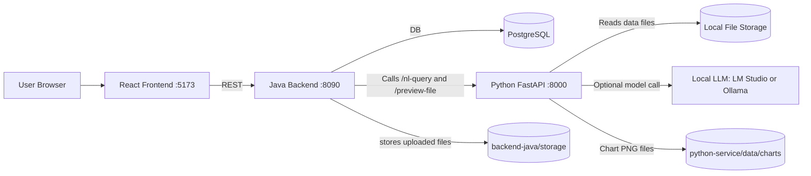
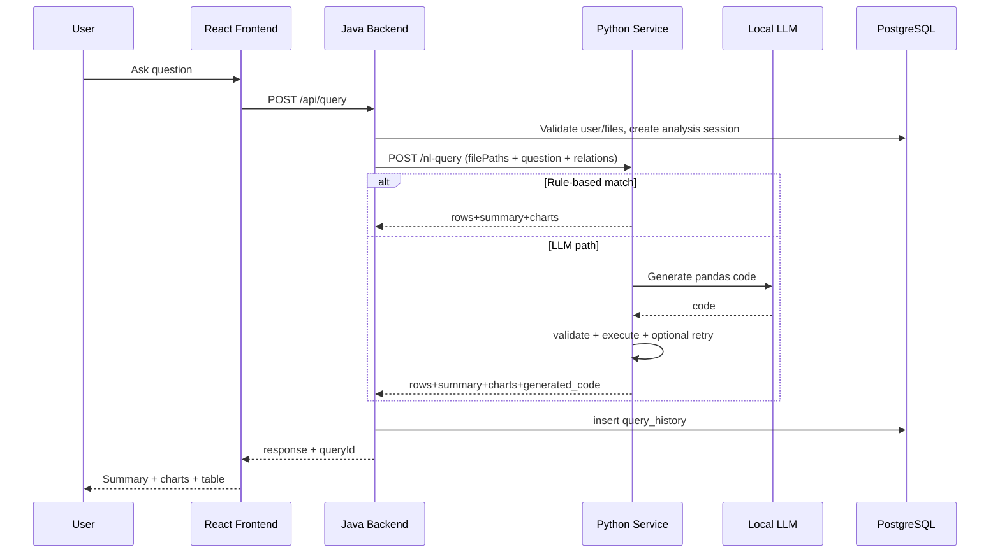
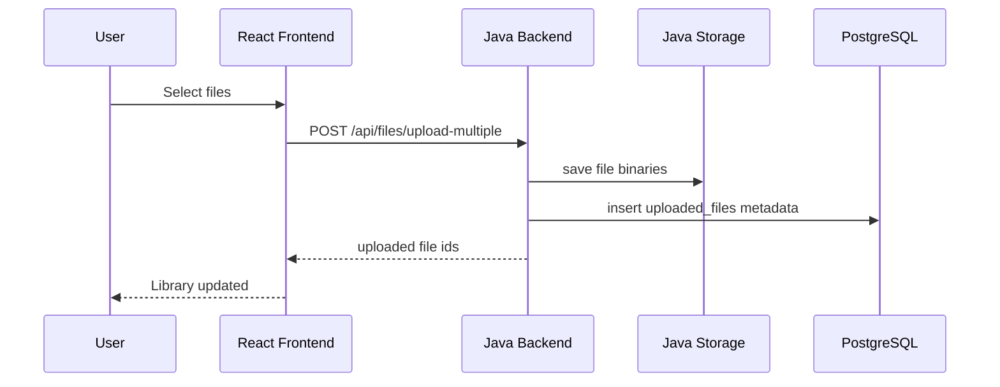

# AI Analytics Suite - Master Documentation + PPT Content

This single file contains:

1. Complete technical documentation of the full system.
2. Complete PPT content (slide-by-slide) you can copy directly into PowerPoint.

Scope covered in full detail:

- Frontend React app: hackathoz_frontend_rebuild_v3
- Java backend: backend-java
- Python service: python-service

---

## 1) Executive Overview

This project is a local-first AI analytics platform where users can:

- Register/login.
- Upload CSV/Excel files.
- Preview uploaded files.
- Ask natural-language questions.
- Get tabular answers + charts.
- Define relationships (joins) across files.
- Save and load dashboard configurations.
- View query history.

The architecture is split across 3 runtime services:

- React frontend (port 5173): user interface.
- Java Spring Boot backend (port 8090): orchestration, storage metadata in PostgreSQL, file persistence, API facade.
- Python FastAPI service (port 8000): dataframe operations, NL query execution, LLM integration, chart rendering.

---

## 2) High-Level Architecture

Key design pattern:

- Java backend owns user-facing API and DB entities.
- Python service owns NL query logic and chart generation.
- Java sends file path(s) + question to Python.
- Python returns rows/charts/summary.
- Java stores history and returns final payload to frontend.

---

## 3) Technology Stack and Dependencies

### Frontend (React + Vite)

- React 18.3.1
- Axios 1.7.2
- Recharts 2.12.7
- Vite 5.3.4

Main config:

- Vite dev server host true, port 5173.

### Java Backend (Spring Boot)

- Spring Boot 3.5.0
- Java version property: 25
- Spring Web
- Spring Validation
- Spring Data JPA
- Spring Security
- PostgreSQL JDBC driver 42.7.11
- JJWT (API/impl/jackson) 0.11.5 (present, not fully integrated for real JWT)
- Springdoc OpenAPI UI 2.4.0

### Python Service (FastAPI + Data)

- FastAPI 0.111.0
- Uvicorn 0.29.0
- Pandas 2.2.2
- NumPy 2.4.6
- Matplotlib 3.10.3
- OpenPyXL 3.1.5
- httpx 0.27.0
- SQLite (built-in)

LLM adapters supported:

- LM Studio OpenAI-compatible endpoint.
- Ollama chat endpoint.

---

## 4) Runtime Configuration

### Java application.yml

- server.port: 8090
- spring.datasource.url: jdbc:postgresql://localhost:5432/ai_analytics
- spring.datasource.username: postgres
- spring.datasource.password: pulkit@sql
- spring.jpa.hibernate.ddl-auto: update
- app.storage-root: ./storage
- app.python-service-base-url: http://localhost:8000
- app.jwt-secret: change-this-secret

### Python environment variables

- LOCAL_LLM_PROVIDER: lmstudio | ollama | none
- LOCAL_LLM_BASE_URL: provider base URL
- LOCAL_LLM_MODEL: local model name

Important behavior:

- If provider is none or call fails to return code, service falls back to deterministic rule-based defaults.

---

## 5) Detailed Component Breakdown

## 5.1 Frontend Detailed Behavior

Entry:

- src/main.jsx mounts App with React.StrictMode.
- src/App.jsx controls all app state and routing between screens:
  - login
  - upload
  - workspace

Main state in App:

- Auth/session: email, password, token.
- Files and preview: files, selectedFiles, previewByFileId, activeFileId.
- Query context: question, chartType, selectedRelationshipIds.
- Results: latestResult.
- Chat experience: chatMessages, expandedReplies.
- History and dashboards: history, dashboards, dashboardName.
- local cache: historyCache (per email + file id key in localStorage).

API base URL used by frontend:

- http://localhost:8090/api

### Frontend screens

AuthScreen:

- Calls /api/auth/login or /api/auth/register.
- On success stores:
  - analytics_token
  - analytics_email
- Then loads workspace lists.

UploadScreen:

- Multi-file picker (csv/xlsx/xls).
- Calls /api/files/upload-multiple with FormData:
  - files[]
  - email
- Shows uploaded file library.
- Preview button calls /api/files/{id}/preview.
- Analyze button opens workspace for selected file.

WorkspaceScreen:

- Top area:
  - HistorySidebar: search/filter/open old queries.
  - ChatWindow: ask question + choose chartType + relationship toggles.
- Bottom area:
  - ResultPanel: summary, charts, table, dashboard save/load.

HistorySidebar filters:

- all
- recent (last 24h)
- withCharts
- failed

ChatWindow behavior:

- Prevents duplicate concurrent query submissions.
- Sends query payload to backend:
  - email
  - fileIds [activeFileId]
  - relationshipIds []
  - question
  - chartType

ResultPanel behavior:

- Renders summary text.
- Renders charts via AnimatedCharts (Recharts).
- Renders table with DataTable.
- Saves dashboard via /api/query/dashboards.
- Loads dashboard by parsing stored configJson.

Charts in frontend:

- Requested types from UI: auto, all, bar, line, pie, scatter, area.
- Utility determines numeric columns and constructs chart datasets.
- In auto mode uses metadata from backend if available.

---

## 5.2 Java Backend Detailed Behavior

Main class:

- BackendJavaApplication starts Spring Boot app.

SecurityConfig:

- CSRF disabled.
- auth endpoints and Swagger endpoints permitAll.
- Currently anyRequest permitAll.
- HTTP Basic enabled but no restrictive auth enforcement.

Important practical note:

- Frontend sends Authorization Bearer token, but Java currently does not validate real JWT.
- Login currently returns token = demo-token.

### Data model entities (PostgreSQL)

User:

- id
- email (unique)
- passwordHash

UploadedFile:

- id
- owner
- originalName
- storedPath
- uploadedAt

AnalysisSession:

- id
- owner
- file (optional if multi-file)
- name
- createdAt

FileRelationship:

- id
- owner
- leftFile
- rightFile
- leftKey
- rightKey
- joinType
- createdAt

QueryHistory:

- id
- owner
- session
- question
- resultPreviewJson
- summary
- status
- chartDownloadUrl
- createdAt

Dashboard:

- id
- owner
- name
- configJson
- createdAt
- updatedAt

### Repositories

Simple Spring Data JPA interfaces:

- UserRepository.findByEmail
- UploadedFileRepository.findByOwner
- AnalysisSessionRepository.findByOwner
- FileRelationshipRepository.findByOwner
- QueryHistoryRepository.findByOwnerOrderByCreatedAtDesc
- DashboardRepository.findByOwnerOrderByUpdatedAtDesc

### Controllers

AuthController:

- POST /api/auth/register
  - Validates duplicate email.
  - BCrypt hashes password.
  - Saves user.
- POST /api/auth/login
  - Validates BCrypt password.
  - Returns token demo-token + email.

FileController:

- POST /api/files/upload
  - single file upload + email
- POST /api/files/upload-multiple
  - multiple file upload + email
- GET /api/files
  - list files for user
- GET /api/files/{fileId}/preview
  - resolves ownership
  - calls Python /preview-file with filePath and limit

Storage behavior:

- Files physically stored in backend-java/storage with timestamp prefix.
- UploadedFile.storedPath contains absolute file system path.

QueryController:

Main query endpoint:

- POST /api/query

Flow:

1. Resolve user by email.
2. Resolve file list from fileId/fileIds.
3. Ownership validation for all files.
4. Create AnalysisSession.
5. Build Python payload:
   - sessionId
   - filePath (first file)
   - filePaths (all selected files)
   - question
   - chartType
   - optional relationships[] with leftPath/rightPath and keys
6. Call Python /nl-query.
7. Normalize chart download URLs to absolute URL if needed.
8. Save QueryHistory with summary, result preview, chart URL.
9. Return Python response + queryId.

Other QueryController endpoints:

- POST /api/query/relationships
- GET /api/query/relationships
- GET /api/query/history
- POST /api/query/dashboards
- GET /api/query/dashboards

Error handling:

- Python service HTTP errors -> 502 with details.
- Generic errors -> 500 with details.

---

## 5.3 Python Service Detailed Behavior

Main app file:

- app/main.py

The Python service has two API styles:

1. Java-integrated style (used by current frontend path through Java):
   - POST /preview-file
   - POST /nl-query
2. Native Python authenticated style (token in memory) for direct usage:
   - /auth/register, /auth/login, /datasets/*, /relationships, /query, /history, /dashboards

Storage layout:

- data/app.db (SQLite)
- data/uploads (uploaded datasets for native mode)
- data/charts (generated PNG charts)

### DB tables in SQLite

- users
- datasets
- relationships
- query_history
- dashboards

### Core data profiling

When dataset loaded:

- detect_column_kind checks boolean/numeric/date/text.
- Also heuristic parsing for string dates and numeric strings.
- profile_dataframe stores per-column profile.

### Local LLM integration

Function: call_local_llm(prompt)

If LOCAL_LLM_PROVIDER == lmstudio:

- POST {base}/v1/chat/completions
- System prompt enforces safe pandas code with result assignment.

If provider == ollama:

- POST {base}/api/chat
- Similar instruction.

If provider is none:

- returns empty string; fallback path triggers.

### Code extraction and safety

- extract_code reads fenced python blocks if present.
- validate_generated_code parses AST and rejects:
  - imports
  - try/with/class/global/nonlocal
  - dangerous calls/modules
- requires assignment to result variable.

### Query execution sandbox

execute_query_code:

- Uses very restricted __builtins__.
- Locals include df copy and pandas only.
- Executes generated code.
- Normalizes result into DataFrame.

### Rule-based intelligence path

Before LLM, service checks intent via core/intents.py:

- wants_full_data
- asks_existence
- asks_count
- asks_schema
- asks_specific_lookup
- asks_comparison

If matched, it bypasses LLM and uses deterministic fallback logic.

This is important because:

- Simple factual lookups become faster and safer.
- It avoids model uncertainty for common business queries.

### LLM + retry loop path

If not rule-based:

1. Build prompt from schema + question.
2. Call local LLM.
3. Execute generated code.
4. On failure:
   - build retry prompt with previous code + error
   - ask model to correct code
5. If still failing:
   - fallback to default deterministic result.

Return payload includes:

- rows
- columns
- chart + charts
- summary
- generated_code
- attempts

### Chart generation path

Chart module: core/charts.py

Supported chart types:

- line
- bar
- scatter
- hist
- box
- area
- pie
- violin
- heatmap

Flow:

1. choose_chart_specs determines xField/yField and chart type list.
2. render_chart_png creates matplotlib chart.
3. Saves PNG under data/charts/chart_<uuid>.png.
4. Returns downloadUrl /charts/{file}.

### Join handling path for Java requests

build_dataframe_from_java_request:

1. Collects filePath + filePaths.
2. Normalizes paths.
3. Validates files exist.
4. If no relationships -> first file DataFrame used.
5. Else iteratively merges based on relationships:
   - leftPath/rightPath
   - leftKey/rightKey
   - joinType inner/left/right/outer

---

## 6) Full End-to-End Data Processing (Step by Step)

This section answers exactly: how data goes in, how it gets processed, and how it returns.

### Step A - User login

1. User enters email/password in frontend AuthScreen.
2. Frontend calls Java POST /api/auth/login.
3. Java validates against PostgreSQL users.passwordHash using BCrypt.
4. Java returns demo-token and email.
5. Frontend stores token/email in localStorage.

### Step B - File upload

1. User selects files in UploadScreen.
2. Frontend sends multipart to Java /api/files/upload-multiple.
3. Java writes each file to backend-java/storage/<timestamp>_<originalname>.
4. Java inserts uploaded_files rows with absolute storedPath.
5. Frontend refreshes file list.

### Step C - Preview

1. User clicks Preview.
2. Frontend calls Java /api/files/{id}/preview?email=...
3. Java validates owner.
4. Java calls Python /preview-file with actual filePath.
5. Python reads file with pandas (csv/excel loader).
6. Python returns rows + columns + columnProfile.
7. Java forwards response to frontend.
8. Frontend displays table preview.

### Step D - Ask NL query

1. User asks question in ChatWindow.
2. Frontend sends Java /api/query with:
   - email
   - active file id
   - optional relationship ids
   - chart type
3. Java resolves owned files and relationship records.
4. Java creates AnalysisSession row.
5. Java builds payload for Python /nl-query containing absolute paths and join specs.

### Step E - Python query processing

1. Python builds dataframe:
   - single file or merged multi-file relation.
2. Python inspects intent.
3. If simple intent:
   - rule-based deterministic output.
4. Else:
   - build prompt from dataframe schema + question.
   - call local LLM provider.
   - extract and AST-validate code.
   - execute in restricted sandbox.
   - retry once on failure.
   - final fallback to rule-based.
5. Python decides chart generation eligibility.
6. Python renders chart PNG(s) and produces chart metadata.
7. Python returns rows, columns, summary, chart URLs, generated code, attempts.

### Step F - Java persistence and response shaping

1. Java receives Python response.
2. Java rewrites relative chart URLs to absolute using python base URL.
3. Java inserts QueryHistory row:
   - question
   - summary
   - result preview json
   - chart URL
   - status success
4. Java adds queryId into response.
5. Java returns to frontend.

### Step G - Frontend render and local cache

1. Frontend normalizes payload to safe result structure.
2. Summary message added to chat as assistant message.
3. ResultPanel renders:
   - summary
   - charts via Recharts
   - tabular data
4. Frontend caches answer in localStorage history cache per user/file.
5. History list refreshes from backend.

### Step H - Dashboard save/load

1. Save:
   - frontend sends Java /api/query/dashboards with config JSON (file, relationship ids, question, result, chartType).
2. Java stores dashboard configJson in PostgreSQL.
3. Load:
   - frontend parses configJson and restores workspace context.

---

## 7) What Model Is Used, How, and When

Model integration is in Python service function call_local_llm.

Providers:

- LM Studio (OpenAI-compatible chat completion endpoint)
- Ollama (/api/chat endpoint)

Model name:

- Whatever is set in LOCAL_LLM_MODEL.
- The specific model is not hardcoded in code; it is runtime-configurable.

When model is used:

- Only when intent detector decides the question is not handled by rule-based logic.
- For simple count/existence/schema/full-data/lookup requests, model is skipped.

How model output is used:

1. Prompt asks for pandas code only.
2. Output code is extracted.
3. AST validator enforces safety constraints.
4. Code executed with restricted builtins and df+pd only.
5. If error, model is prompted for corrected code once.
6. If still bad, fallback deterministic result returned.

Why this hybrid approach matters:

- Rule-based for reliability and speed.
- LLM for flexible analytical questions.
- Validation/sandbox for security and stability.

---

## 8) API Inventory (Practical)

### Frontend -> Java

Auth:

- POST /api/auth/register
- POST /api/auth/login

Files:

- POST /api/files/upload
- POST /api/files/upload-multiple
- GET /api/files
- GET /api/files/{fileId}/preview

Query/workspace:

- POST /api/query
- POST /api/query/relationships
- GET /api/query/relationships
- GET /api/query/history
- POST /api/query/dashboards
- GET /api/query/dashboards

### Java -> Python (bridge)

- POST /preview-file
- POST /nl-query

### Python native (direct mode, not main frontend path)

- POST /auth/register
- POST /auth/login
- POST /datasets/upload
- GET /datasets
- GET /datasets/{dataset_id}/preview
- POST /relationships
- GET /relationships
- POST /query
- GET /charts/{chart_file_name}
- GET /history
- POST /dashboards
- GET /dashboards
- GET /dashboards/{dashboard_id}

---

## 9) Data Stores and Persistence Map

PostgreSQL (Java side):

- users
- uploaded_files
- analysis_sessions
- file_relationships
- query_history
- dashboards

SQLite (Python side):

- users
- datasets
- relationships
- query_history
- dashboards

Filesystem:

- backend-java/storage: uploaded source files from Java flow.
- python-service/data/uploads: uploaded datasets in direct Python mode.
- python-service/data/charts: generated chart png files.

Important architecture note:

- The current full app flow mainly persists metadata and query history in PostgreSQL.
- Python service also has its own independent persistence for its native endpoints.

---

## 10) Sequence Diagrams

### Query sequence

### File upload sequence

---

## 11) Key Strengths and Current Gaps

Strengths:

- Clean 3-tier split and clear orchestration boundaries.
- Hybrid deterministic + LLM querying increases reliability.
- Safe code validation before dynamic execution.
- Multi-file relationship joins supported.
- Chart generation pipeline supports many chart types.
- Good UX flow with upload, chat, history, dashboards.

Current gaps/risk points:

- Java auth token is demo-token (not real JWT verification).
- Java SecurityConfig permits all routes currently.
- Hardcoded DB password in application.yml.
- Dual persistence design (PostgreSQL + SQLite) can create data divergence depending on used endpoints.
- CORS is fully open in both Java and Python.

---

## 12) Operational Runbook

Run order:

1. Start PostgreSQL database and ensure ai_analytics exists.
2. Start Python service on 8000.
3. Start Java backend on 8090.
4. Start frontend on 5173.

Health checks:

- Python: GET /health
- Java: test auth or files endpoints
- Frontend: load app page

Minimal smoke test:

1. Register/login user.
2. Upload one CSV.
3. Preview file.
4. Ask count query.
5. Ask comparison query (LLM path likely).
6. Save dashboard.
7. Reopen from history.

---

## 13) Complete PPT Content (Slide-by-Slide)

Use these slides directly in PowerPoint. Each slide includes title + body + speaker notes.

### Slide 1 - Title

Title:

- AI Analytics Suite: End-to-End Technical Deep Dive

Body:

- React Frontend + Java Backend + Python AI Service
- Natural language analytics on CSV/Excel with chart outputs
- Hybrid rule-based and local LLM execution model

Speaker notes:

- This presentation explains every step from file upload to model-generated analytical response and chart rendering.

### Slide 2 - Problem Statement

Body:

- Business users need answers from raw tabular files quickly.
- SQL or scripting is not accessible to all users.
- Need secure, explainable NL-to-analysis workflow.

Speaker notes:

- The platform turns plain-language questions into reliable data operations with safety guardrails.

### Slide 3 - Solution Overview

Body:

- Upload data files.
- Preview and profile columns.
- Ask natural-language questions.
- Receive summary + table + visualizations.
- Save dashboards and reuse historical context.

### Slide 4 - Architecture Diagram

Body:

- Browser -> React -> Java -> Python -> Local LLM
- PostgreSQL for Java metadata/history
- SQLite for Python native mode
- Local files for dataset and chart artifacts

Speaker notes:

- Java is orchestration layer; Python is analytics/AI execution layer.

### Slide 5 - Frontend Architecture

Body:

- App state hub in App.jsx
- 3 screens: Auth, Upload, Workspace
- Components: HistorySidebar, ChatWindow, ResultPanel
- Recharts-based visual rendering

### Slide 6 - Frontend Data Flow

Body:

- Login -> cache token/email
- Upload files -> refresh library
- Preview file -> table + columns
- Ask query -> show summary/charts/table
- Save/load dashboard configs

### Slide 7 - Java Backend Architecture

Body:

- Spring Boot REST controllers
- JPA entities + repositories
- File storage + Python orchestration
- Query/session/history persistence

### Slide 8 - Java Security and Auth Reality

Body:

- Password hashing with BCrypt
- Login returns demo-token
- Security config currently permitAll for all routes
- JWT dependencies present but not fully wired

Speaker notes:

- This is functional for demo but should be hardened for production.

### Slide 9 - Python Service Architecture

Body:

- FastAPI endpoints
- Pandas data loading and transformation
- Intent detection + deterministic fallback
- Local LLM generated pandas code path
- Matplotlib chart rendering

### Slide 10 - Data Profiling Logic

Body:

- Detects boolean, numeric, date, text
- Uses dtype plus heuristic parsing
- Produces per-column profile metadata

### Slide 11 - NL Query Engine Modes

Body:

- Mode 1: Rule-based (count, schema, lookup, full data)
- Mode 2: LLM-generated pandas code
- Mode 3: Retry-on-error correction
- Mode 4: deterministic fallback on failure

### Slide 12 - Model Usage Details

Body:

- Provider options: LM Studio, Ollama
- Model name from LOCAL_LLM_MODEL env var
- Prompt includes dataframe schema and strict output rules
- AST safety validation before execution

### Slide 13 - Code Safety Guardrails

Body:

- Forbidden imports and risky nodes
- Forbidden calls (eval, exec, open, subprocess, etc.)
- Mandatory result assignment
- Restricted builtins during exec

### Slide 14 - Relationship Join Processing

Body:

- Accepts file paths and relationship specs
- Validates key existence and join type
- Iterative pandas merge for multi-file context

### Slide 15 - Chart Generation Pipeline

Body:

- Auto/spec chart type selection
- Supports bar/line/pie/scatter/area/hist/box/violin/heatmap
- Saves PNG artifacts
- Returns chart download URLs

### Slide 16 - End-to-End Query Sequence

Body:

- Frontend sends /api/query
- Java validates + session creation
- Java calls Python /nl-query
- Python executes rule-based or LLM path
- Java stores query history and returns response

### Slide 17 - Storage and Persistence

Body:

- PostgreSQL: users/files/sessions/relationships/history/dashboards
- SQLite: Python native users/datasets/query history
- Filesystem: uploaded files + chart images

### Slide 18 - Error Handling Strategy

Body:

- Java handles Python upstream errors (502)
- Python handles validation and execution failures
- LLM retry logic with previous error feedback
- UI surfaces parsed API errors to user chat

### Slide 19 - UX Features

Body:

- History search/filter modes
- Assistant reply expansion in chat
- Local answer cache by user/file
- Dashboard save/load shortcuts

### Slide 20 - Performance and Scalability Notes

Body:

- Preview limits row count
- Result capping (default up to 5000 unless full requested)
- Charts render on top rows for responsiveness
- Modular service split for future scaling

### Slide 21 - Risks and Technical Debt

Body:

- Non-production auth token model
- Permit-all backend security policy
- Hardcoded DB credentials in config
- Duplicate persistence stacks require governance

### Slide 22 - Hardening Roadmap

Body:

- Implement real JWT issue/validation in Java
- Tighten endpoint authorization
- Move secrets to env/secret manager
- Add tracing and request IDs across services
- Add test suites for prompt/code validation paths

### Slide 23 - Demo Walkthrough Script

Body:

- Login
- Upload two files
- Create relationship
- Ask count + comparative trend question
- Inspect chart and table
- Save and reload dashboard

### Slide 24 - Key Takeaways

Body:

- System supports practical NL analytics workflow today.
- Hybrid rule-based + LLM approach improves reliability.
- Architecture is extensible and productionizable with security hardening.

### Slide 25 - Q&A

Body:

- Full technical details available in this master document.

---

## 14) Appendix - Exact Folder Ownership Summary

Frontend folder:

- hackathoz_frontend_rebuild_v3

Java folder:

- backend-java

Python folder:

- python-service

Single-file master output created by request:

- MASTER_PROJECT_DOCUMENTATION_AND_PPT.md

---

## 15) Final Notes

This file is intentionally comprehensive and designed for both:

- project handover documentation
- direct PPT generation source

If you want, this can be expanded further into:

- a fully formatted .pptx deck with speaker notes and design theme
- a separate formal architecture document (SRS + HLD + LLD structure)
- an API contract document with full request/response JSON examples per endpoint
